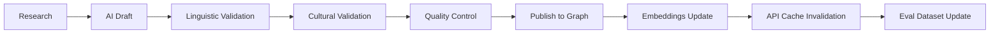

# Darija Knowledge Graph Specification

**Version:** 1.0
**Date:** 2026-08-22
**Classification:** Internal Technical Specification
**Purpose:** Technical blueprint for Langzio's structured Darija knowledge base

---

## 1. ARCHITECTURAL PRINCIPLES

### 1.1 Design Goals
- **Single Source of Truth** — All Darija content derives from the graph
- **AI-Ready** — Structured for RAG retrieval, fine-tuning, and reasoning
- **Extensible** — New entity types, relationships, properties without migration
- **Versioned** — Every change tracked; reproducible snapshots
- **Multilingual** — Arabic script, Langzio Latin, Arabizi, IPA, French, English
- **Culturally Grounded** — Every entity carries cultural provenance

### 1.2 Non-Goals
- Not a general-purpose knowledge graph (no Wikidata replication)
- Not a replacement for linguistic databases (no etymology, historical linguistics)
- Not a user-facing product (powers products via API)

---

## 2. ENTITY TYPES (NODES)

### 2.1 Core Entity Hierarchy

```
Entity (abstract)
├── LinguisticEntity
│   ├── Lexeme           # Word/lemma (e.g., "salam")
│   ├── Phrase           # Multi-word expression (e.g., "salam wach kayn blassa")
│   ├── Morpheme         # Bound morpheme (prefix, suffix, circumfix)
│   └── Phoneme          # Sound unit with Darija-specific features
├── CulturalEntity
│   ├── CulturalConcept  # Hospitality, Bargaining, Greeting Rituals, etc.
│   ├── SocialNorm       # Specific rule (e.g., "greet elders first")
│   ├── Register         # Polite, Neutral, Casual, Formal, Intimate
│   └── RegionalVariant  # Urban, Rural, Northern, Southern, etc.
├── LearningEntity
│   ├── Lesson           # Structured learning unit (Day 1, Week 1, etc.)
│   ├── Curriculum       # Ordered sequence (7-Day Challenge, D1-D5 levels)
│   ├── Exercise         # Practice unit (flashcard, roleplay, pronunciation)
│   └── MasteryConcept   # Trackable skill (vocab, grammar, pronunciation)
├── MediaEntity
│   ├── AudioRecording   # Native speaker pronunciation
│   ├── AudioPair        # Minimal pair for discrimination
│   └── Transcription    # Time-aligned transcription
├── UserEntity
│   ├── LearnerModel     # Per-user knowledge state
│   ├── MasteryScore     # Per-concept mastery (0-5)
│   └── ConversationLog  # Anonymized conversation history
└── StructuralEntity
    ├── Category         # Basics, Restaurant, Souk, Taxi, Family, Travel
    ├── Guide            # Situational guide (Restaurant Guide, etc.)
    └── Scenario         # Roleplay scenario (Taxi Ride, Souk Bargaining)
```

### 2.2 Entity Definitions (Selected)

#### Lexeme (Word/Lemma)
```typescript
interface Lexeme {
  id: string;                    // "lex_salam"
  lemma: string;                 // "salam" (Langzio Latin canonical)
  pos: PartOfSpeech;             // noun, verb, particle, interjection, etc.
  arabic_script: string;         // "سلام"
  arabizi: string[];             // ["salam", "salaam", "ssalam"]
  ipa: string;                   // "/saˈlam/"
  frequency_rank: number;        // Corpus frequency (1 = most frequent)
  dialect_distribution: {        // Regional usage
    urban: number;               // 0-1
    rural: number;
    northern: number;
    southern: number;
  };
  register_default: Register;    // Default politeness level
  cultural_concepts: string[];   // ["greeting_rituals", "hospitality"]
  glosses: {                     // Meanings in context
    en: string;                  // "hello / peace"
    fr: string;                  // "salut / paix"
    context_notes: string;       // "Universal greeting, all contexts"
  };
  morphology: {
    root: string;                // "s-l-m"
    pattern: string;             // "faʕal"
    variants: string[];          // ["salam", "slem", "slam"]
  };
  pronunciation: {
    stress: "ultimate" | "penultimate" | "antepenultimate";
    phonemes: PhonemeRef[];      // References to Phoneme entities
    audio_refs: AudioRecordingRef[];
  };
  relationships: Relationship[]; // See Relationship Types
  provenance: Provenance;        // Source, validators, confidence
  created_at: ISO8601;
  updated_at: ISO8601;
  version: number;
}
```

#### Phrase (Multi-word Expression)
```typescript
interface Phrase {
  id: string;                    // "phr_salam_wach_kayn_blassa"
  text: string;                  // "Salam, wach kayn blassa?"
  text_arabic: string;           // "سلام، واش كاين بلاصة؟"
  text_arabizi: string;          // "salam, wach kayn blassa?"
  component_lexemes: LexemeRef[]; // Ordered references
  meaning: {
    en: string;                  // "Hello, is there a table available?"
    fr: string;                  // "Bonjour, y a-t-il une table ?"
    literal: string;             // "Peace, is there place?"
  };
  pronunciation: string;         // "sa-lam, wach kayn blas-sa"
  register: Register;            // "polite"
  category: CategoryRef;         // "restaurant"
  cultural_context: string;      // "Always start with Salam..."
  avoidance: string;             // "Walking in silently..."
  tip: string;                   // "Add '3afak' to soften..."
  exemplifies: CulturalConceptRef[]; // ["hospitality", "politeness_register"]
  difficulty: "beginner" | "intermediate" | "advanced";
  usage_frequency: "high" | "medium" | "low";
  audio_refs: AudioRecordingRef[];
  provenance: Provenance;
}
```

#### CulturalConcept
```typescript
interface CulturalConcept {
  id: string;                    // "hospitality_diyafa"
  name: string;                  // "Moroccan Hospitality (Diyafa)"
  name_arabic: string;           // "الضيافة"
  description: string;           // "The cultural code of generous hosting..."
  manifestations: PhraseRef[];   // Phrases that exemplify this concept
  social_norms: SocialNormRef[]; // Specific rules
  register_implications: RegisterRef[]; // How it affects politeness
  regional_variation: RegionalVariantRef[]; // Urban vs rural differences
  related_concepts: CulturalConceptRef[]; // ["greeting_rituals", "politeness"]
  diaspora_relevance: "high" | "medium" | "low";
  teaching_priority: number;     // 1-10
  provenance: Provenance;
}
```

#### LearnerModel (Per-User)
```typescript
interface LearnerModel {
  user_id: string;
  persona: "tourist" | "diaspora" | "expat" | "heritage" | "enthusiast";
  level: "D0" | "D1" | "D2" | "D3" | "D4" | "D5";
  vocabulary_knowledge: Map<LexemeRef, MasteryScore>; // 0-5
  grammar_knowledge: Map<GrammarConceptRef, MasteryScore>;
  phrase_mastery: Map<PhraseRef, MasteryScore>;
  pronunciation_profile: {
    phoneme_accuracy: Map<PhonemeRef, number>; // 0-1
    systematic_errors: PhonemeRef[];           // Consistently missed
    strength: PhonemeRef[];                    // Consistently correct
  };
  cultural_awareness: Map<CulturalConceptRef, MasteryScore>;
  weak_areas: ConceptRef[];                    // Prioritized for practice
  goals: string[];                             // ["travel", "family", "fluency"]
  conversation_history: ConversationSummary[]; // Last 50 sessions
  last_updated: ISO8601;
}
```

---

## 3. RELATIONSHIP TYPES (EDGES)

### 3.1 Linguistic Relationships

| Relationship | Domain | Range | Properties | Description |
|--------------|--------|-------|------------|-------------|
| `has_lemma` | Phrase | Lexeme | `position: number` | Phrase contains lexeme at position |
| `has_morpheme` | Lexeme | Morpheme | `type: "prefix"\|"suffix"\|"circumfix"\|"root"` | Morphological composition |
| `has_allomorph` | Lexeme | Lexeme | `condition: string` | Contextual variant (e.g., "kayn" → "kan" before pronoun) |
| `derives_from` | Lexeme | Lexeme | `type: "loan"\|"derivation"\|"compound"` | Etymological relationship |
| `loan_from` | Lexeme | Language | `source_word: string` | French "compteur" → Darija "compteur" |
| `synonym_of` | Lexeme | Lexeme | `register_diff: number` | Near-synonym with register shift |
| `antonym_of` | Lexeme | Lexeme | — | Opposite meaning |
| `collocates_with` | Lexeme | Lexeme | `frequency: number, mi_score: number` | Statistical co-occurrence |
| `minimal_pair_with` | Lexeme | Lexeme | `contrasting_phoneme: PhonemeRef` | For pronunciation practice |
| `has_phoneme` | Lexeme | Phoneme | `position: number, allophone?: string` | Phonemic transcription |

### 3.2 Cultural Relationships

| Relationship | Domain | Range | Properties | Description |
|--------------|--------|-------|------------|-------------|
| `exemplifies` | Phrase | CulturalConcept | `prominence: "primary"\|"secondary"` | Phrase demonstrates concept |
| `manifests_in` | CulturalConcept | Phrase | `context: string` | Concept appears in phrase |
| `requires_register` | CulturalConcept | Register | `strictness: "required"\|"preferred"\|"avoided"` | Concept mandates register |
| `varies_by_region` | CulturalConcept | RegionalVariant | `difference: string` | Regional manifestation |
| `conflicts_with` | CulturalConcept | CulturalConcept | `context: string` | Mutually exclusive norms |
| `prerequisite_for` | CulturalConcept | CulturalConcept | — | Concept A needed before B |

### 3.3 Learning Relationships

| Relationship | Domain | Range | Properties | Description |
|--------------|--------|-------|------------|-------------|
| `teaches` | Lesson | ConceptRef | `depth: "introduce"\|"practice"\|"master"` | Lesson teaches concept |
| `prerequisite_for` | ConceptRef | ConceptRef | `type: "hard"\|"soft"` | Hard = required; Soft = recommended |
| `practices` | Exercise | ConceptRef | `repetitions: number` | Exercise practices concept |
| `assesses` | Exercise | ConceptRef | `weight: number` | Exercise tests concept |
| `unlocks` | MasteryConcept | Lesson\|Exercise | `threshold: number` | Mastery unlocks content |
| `spaced_repetition_for` | ConceptRef | Lexeme\|Phrase | `interval_days: number` | SRS scheduling |

### 3.4 User Relationships

| Relationship | Domain | Range | Properties | Description |
|--------------|--------|-------|------------|-------------|
| `knows` | LearnerModel | Lexeme\|Phrase\|Concept | `mastery: 0-5, confidence: 0-1, last_practiced: date` | User knowledge state |
| `struggles_with` | LearnerModel | ConceptRef | `error_rate: number, last_error: date` | Prioritized weakness |
| `mastered` | LearnerModel | ConceptRef | `mastery: 5, stabilized: boolean` | Stable knowledge |
| `practiced` | LearnerModel | ExerciseRef | `timestamp, score, duration` | Practice log |
| `conversed_about` | LearnerModel | CulturalConcept\|Phrase | `turns: number, depth: "surface"\|"deep"` | Conversation topics |

---

## 4. PROVENANCE & QUALITY

### 4.1 Provenance Model
```typescript
interface Provenance {
  source: "native_speaker" | "linguistic_reference" | "corpus" | "expert_annotation" | "derived";
  source_detail: string;           // "Validator: Fatima Z. (Casablanca), 2026-03-15"
  validators: ValidatorRef[];      // Native speakers who approved
  confidence: number;              // 0-1
  validation_date: ISO8601;
  review_status: "validated" | "needs_review" | "disputed" | "deprecated";
  notes: string;
}
```

### 4.2 Validator System
```typescript
interface Validator {
  id: string;                      // "val_fatima_z"
  name: string;                    // "Fatima Z."
  region: "casablanca" | "rabat" | "marrakech" | "fes" | "tangier" | "other";
  background: "native" | "linguist" | "teacher" | "diaspora";
  specialties: string[];           // ["restaurant", "family", "pronunciation"]
  reliability_score: number;       // Inter-annotator agreement
  validated_count: number;
}
```

### 4.3 Quality Metrics per Entity
| Metric | Target | Measurement |
|--------|--------|-------------|
| **Validation Coverage** | 100% | Every entity has ≥2 validators |
| **Inter-Annotator Agreement** | κ > 0.85 | Cohen's kappa on sample |
| **Confidence Score** | >0.9 avg | Provenance.confidence |
| **Completeness** | 100% required fields | Schema validation |
| **Audio Coverage (Top 500)** | 100% | AudioRecordingRef exists |

---

## 5. DATA STORAGE & ACCESS

### 5.1 Primary Store: PostgreSQL + pgvector
```sql
-- Core tables
CREATE TABLE entities (
  id UUID PRIMARY KEY,
  type VARCHAR(50) NOT NULL,           -- 'Lexeme', 'Phrase', etc.
  data JSONB NOT NULL,                 -- Full entity per schema
  embedding VECTOR(768),               -- For semantic search
  created_at TIMESTAMPTZ DEFAULT NOW(),
  updated_at TIMESTAMPTZ DEFAULT NOW(),
  version INT DEFAULT 1,
  provenance JSONB NOT NULL
);

CREATE TABLE relationships (
  id UUID PRIMARY KEY,
  source_id UUID REFERENCES entities(id),
  target_id UUID REFERENCES entities(id),
  type VARCHAR(50) NOT NULL,
  properties JSONB DEFAULT '{}',
  provenance JSONB NOT NULL,
  created_at TIMESTAMPTZ DEFAULT NOW()
);

-- Indexes
CREATE INDEX idx_entities_type ON entities(type);
CREATE INDEX idx_entities_embedding ON entities USING ivfflat (embedding vector_cosine_ops);
CREATE INDEX idx_relationships_source ON relationships(source_id, type);
CREATE INDEX idx_relationships_target ON relationships(target_id, type);
```

### 5.2 API Layer (GraphQL)
```graphql
type Query {
  # Entity lookup
  lexeme(id: ID!): Lexeme
  lexemeByLemma(lemma: String!, script: Script): Lexeme
  phrase(id: ID!): Phrase
  culturalConcept(id: ID!): CulturalConcept
  
  # Search
  searchLexemes(query: String!, script: Script, limit: Int): [Lexeme!]!
  searchPhrases(query: String!, category: Category, register: Register): [Phrase!]!
  
  # Graph traversal
  relatedLexemes(lexemeId: ID!, relationship: String, depth: Int): [Lexeme!]!
  phraseComponents(phraseId: ID!): [Lexeme!]!
  culturalManifestations(conceptId: ID!): [Phrase!]!
  
  # Learner-specific
  learnerModel(userId: ID!): LearnerModel
  practiceQueue(userId: ID!, limit: Int): [Exercise!]!
  masteryDashboard(userId: ID!): MasteryDashboard
}

type Mutation {
  # Content management (admin)
  createLexeme(input: LexemeInput!): Lexeme
  updateLexeme(id: ID!, input: LexemeInput!): Lexeme
  validateEntity(id: ID!, validatorId: ID!): Entity
  
  # Learner actions
  recordPractice(userId: ID!, exerciseId: ID!, score: Float!): PracticeRecord
  updateMastery(userId: ID!, conceptId: ID!, mastery: Int!): MasteryScore
  logConversation(userId: ID!, summary: ConversationSummary!): ConversationLog
}
```

---

## 6. RAG INTEGRATION

### 6.1 Retrieval Strategy

| Query Type | Retrieval Method | Reranking |
|------------|------------------|-----------|
| **Translation** | Semantic search on Phrase embeddings + Lexeme exact match | Cross-encoder on top-20 |
| **Cultural Chat** | Hybrid: CulturalConcept graph traversal + Phrase semantic search | Cultural relevance score |
| **Tutor** | LearnerModel weak areas → Exercise retrieval + Phrase examples | Pedagogical priority |
| **Pronunciation** | Phoneme graph → Minimal pairs + AudioRecording | Phoneme match + difficulty |

### 6.2 Context Construction
```python
def build_translation_context(user_query: str, user_model: LearnerModel) -> str:
    # 1. Exact phrase matches (highest priority)
    exact_phrases = graph.search_phrases_exact(user_query)
    
    # 2. Semantic phrase matches
    semantic_phrases = graph.search_phrases_semantic(user_query, top_k=10)
    
    # 3. Component lexemes with cultural context
    lexemes = graph.extract_lexemes(user_query)
    lexeme_context = []
    for lex in lexemes:
        context = graph.get_cultural_context(lex, user_model.level)
        lexeme_context.append(context)
    
    # 4. User-level adaptation
    adaptation = f"Learner level: {user_model.level}. "
    if user_model.weak_areas:
        adaptation += f"Focus on: {', '.join(user_model.weak_areas[:3])}. "
    
    return format_rag_context(exact_phrases, semantic_phrases, lexeme_context, adaptation)
```

---

## 7. CONTENT PRODUCTION PIPELINE

### 7.1 Pipeline Stages



### 7.2 Stage Details

| Stage | Input | Process | Output | Validators | SLA |
|-------|-------|---------|--------|------------|-----|
| **Research** | Gap analysis, user questions | Native speaker interviews, corpus analysis, reference check | Research brief with sources | — | 1 week |
| **AI Draft** | Research brief + templates | LLM generates entities (Lexeme, Phrase, etc.) | Draft entities (JSON) | — | 1 hour |
| **Linguistic Validation** | Draft entities | Linguist checks: POS, morphology, phonology, grammar | Validated + corrections | 1 linguist | 2 days |
| **Cultural Validation** | Linguistically validated | Native speakers check: register, context, appropriateness, regional | Culturally validated | 2 native (different regions) | 3 days |
| **Quality Control** | Validated entities | Automated: schema, completeness, uniqueness, embedding generation | QC report | Automated + 1 reviewer | 4 hours |
| **Publish** | QC passed | Write to graph, generate embeddings, invalidate cache | Live entities | Automated | 15 min |

### 7.3 Production Targets

| Metric | Target |
|--------|--------|
| **Throughput** | 50 phrases/week, 200 lexemes/week |
| **Validation Latency** | <5 days end-to-end |
| **Revision Rate** | <10% sent back from cultural validation |
| **Audio Recording** | 100% of top 500 lexemes within 30 days of publish |

---

## 8. VERSIONING & MIGRATION

### 8.1 Entity Versioning
- Every entity has `version` integer
- Updates create new version; old versions retained
- `updated_at` timestamp on every change
- Soft delete via `review_status: "deprecated"`

### 8.2 Schema Evolution
- JSON Schema per entity type (versioned)
- Backward-compatible changes only (add optional fields)
- Breaking changes → new entity type + migration script
- Migration scripts versioned and tested

### 8.3 Snapshot & Rollback
- Daily full graph snapshot to S3
- Point-in-time recovery via WAL
- Rollback procedure documented and tested quarterly

---

## 9. EXTERNAL INTERFACES

### 9.1 Public API (Future)
| Endpoint | Auth | Rate Limit | Use Case |
|----------|------|------------|----------|
| `GET /v1/lexemes/{lemma}` | API Key | 100/min | Dictionary lookup |
| `GET /v1/phrases?category=restaurant` | API Key | 60/min | Guide embedding |
| `POST /v1/translate` | API Key | 30/min | Translation service |
| `GET /v1/cultural-concepts/{id}` | API Key | 100/min | Cultural reference |

### 9.2 Export Formats
| Format | Use Case | Frequency |
|--------|----------|-----------|
| **JSON-LD** | SEO/Schema.org | On publish |
| **RDF/Turtle** | Knowledge graph interop | Monthly |
| **CSV** | Research/analysis | On demand |
| **Anki/Quizlet** | Learner export | User-initiated |

---

## 10. MONITORING & OBSERVABILITY

### 10.1 Graph Health Metrics

| Metric | Target | Alert |
|--------|--------|-------|
| **Entity Count** | Growing | Stagnation >7 days |
| **Validation Coverage** | 100% | <100% |
| **Embedding Freshness** | <24h | >48h |
| **API Latency (p95)** | <200ms | >500ms |
| **Query Success Rate** | >99.9% | <99.5% |

### 10.2 Content Quality Signals
| Signal | Source | Action |
|--------|--------|--------|
| **User Correction** | "Report error" button | Queue for review |
| **Validator Dispute** | Conflicting validations | Senior linguist review |
| **Low Confidence** | Provenance.confidence < 0.7 | Re-validation |
| **High Regeneration** | Translation retry rate | Check phrase quality |

---

## 11. ROADMAP (TECHNICAL)

| Quarter | Milestone |
|---------|-----------|
| **Q1** | Core schema v1.0; PostgreSQL + pgvector; basic CRUD API; 28 seed phrases |
| **Q2** | 500 phrases; 2000 lexemes; GraphQL API; embedding pipeline; RAG integration |
| **Q3** | 2000 phrases; 5000 lexemes; LearnerModel API; CulturalConcept graph complete |
| **Q4** | 5000 phrases; 10000 lexemes; Public API beta; Export formats; LDB benchmark |

---

## 12. GOVERNANCE

### 12.1 Change Control
| Change Type | Approval Required |
|-------------|-------------------|
| New entity type | Tech Lead + Linguist Lead |
| New relationship type | Tech Lead + Cultural Lead |
| Schema modification (breaking) | Tech Lead + Linguist Lead + Cultural Lead |
| Provenance policy | Cultural Lead |
| Validator criteria | Cultural Lead |

### 12.2 Data Ethics
- No PII in graph (LearnerModel separate, anonymized for training)
- Native speaker compensation for validation work
- Cultural knowledge attribution in provenance
- Community correction mechanism for disputes

---

*This specification is the technical foundation for Layer 1 of Langzio's moat. Implementation begins with seed data from `corpus.json` and expands through the content production pipeline.*