# Langzio Entity Relationship Graph

**Version:** 1.0
**Date:** 2026-08-22
**Purpose:** Document all meaningful relationships between entities in the Langzio knowledge domain, grounded in existing product data

---

## RELATIONSHIP DESIGN PRINCIPLES

1. **Only document relationships supported by actual product content/data**
2. **Use Schema.org relationship vocabulary where possible**
3. **Define custom relationship types only when Schema.org lacks equivalent**
4. **Each relationship is directional and typed**
5. **Relationships must be machine-expressible via JSON-LD + internal links**

---

## RELATIONSHIP TYPES USED

| Relationship | Schema.org Property | Custom? | Direction | Description |
|--------------|---------------------|---------|-----------|-------------|
| offers | `offers` | No | Org → Product | Organization provides product/service |
| hasPart | `hasPart` | No | Whole → Part | Compositional hierarchy |
| isPartOf | `isPartOf` | No | Part → Whole | Inverse of hasPart |
| knowsAbout | `knowsAbout` | No | Agent → Topic | Entity has expertise in topic |
| groundedIn | — | Yes | AI → Corpus | AI system uses data source |
| teaches | `teaches` | No | Course → Concept | Educational content teaches concept |
| hasMethodology | — | Yes | Org → Method | Organization uses methodology |
| inLanguage | `inLanguage` | No | Content → Language | Content expressed in language |
| transliterates | — | Yes | Script → Language | Writing system represents language |
| influencedBy | — | Yes | Language → Language | Historical linguistic influence |
| contrastsWith | — | Yes | Concept → Concept | Explicit comparison relationship |
| manifestedIn | — | Yes | CulturalConcept → Phrase | Cultural pattern appears in phrases |
| exemplifies | — | Yes | Concept → Term | Abstract concept shown by concrete term |
| targets | `audience` | No | Product → Audience | Product designed for audience |
| complements | — | Yes | Product → Product | Products work together |
| hasFeature | `featureList` | No | Product → Feature | Product capability |
| usesTechnology | `usesTechnology` | No | Product → Tech | Technical implementation |
| specializesIn | — | Yes | Agent → Domain | AI agent domain focus |
| hasConversationMemory | — | Yes | Chat → Feature | Chat system capability |

---

## COMPLETE RELATIONSHIP GRAPH

### LEVEL 0: ORGANIZATION (Root)

```
Langzio (Organization)
│
├── offers ──────────────────────────────→ Langzio Translator (SoftwareApplication)
├── offers ──────────────────────────────→ Langzio AI Chat (SoftwareApplication)
├── offers ──────────────────────────────→ Langzio Smart Guides (Course/Guide)
├── offers ──────────────────────────────→ Langzio 7-Day Kids Challenge (Course)
├── knowsAbout ──────────────────────────→ Moroccan Darija (Language)
├── knowsAbout ──────────────────────────→ Moroccan Culture (Concept)
├── hasMethodology ──────────────────────→ RAG-Grounded Translation (Method)
├── targets ─────────────────────────────→ Morocco Tourist (Audience)
├── targets ─────────────────────────────→ Moroccan Diaspora Family (Audience)
├── targets ─────────────────────────────→ Digital Nomad (Audience)
├── targets ─────────────────────────────→ Heritage Learner (Audience)
└── hasData ─────────────────────────────→ Verified Phrase Corpus (Dataset)
```

### LEVEL 1: LANGUAGE & WRITING SYSTEMS

```
Moroccan Darija (Language)
│
├── inLanguage ──────────────────────────→ All Verified Phrases (DefinedTerm)
├── inLanguage ──────────────────────────→ All Vocabulary Terms (DefinedTerm)
├── inLanguage ──────────────────────────→ All Guides (Guide)
├── inLanguage ──────────────────────────→ Kids Challenge Content (Course)
├── contrastsWith ───────────────────────→ Modern Standard Arabic (Language)
├── influencedBy ────────────────────────→ French (Language)
├── influencedBy ────────────────────────→ Amazigh/Tamazight (Language)
├── influencedBy ────────────────────────→ Spanish (Language)
├── influencedBy ────────────────────────→ Classical Arabic (Language)
├── transliterates ──────────────────────→ Arabizi (WritingSystem) [inverse]
└── hasDialect ─────────────────────────→ Urban Darija, Rural Darija, Hassaniya
```

```
Arabizi (WritingSystem)
│
├── transliterates ──────────────────────→ Moroccan Darija (Language)
├── usedBy ──────────────────────────────→ Langzio (for learner accessibility)
├── hasMapping ──────────────────────────→ Number-Letter Mappings (DefinedTerm[])
└── hasConvention ───────────────────────→ Langzio Arabizi Standard (Document)
```

```
Modern Standard Arabic (Language)
│
├── isStandardizedFormOf ────────────────→ Arabic (macrolanguage)
├── contrastsWith ───────────────────────→ Moroccan Darija (Language) [inverse]
└── usedIn ──────────────────────────────→ Formal writing, media, education
```

### LEVEL 2: PRODUCT FEATURES

```
Langzio Translator (SoftwareApplication)
│
├── partOf ──────────────────────────────→ Langzio (Organization) [inverse of offers]
├── complements ─────────────────────────→ Langzio AI Chat
├── complements ─────────────────────────→ Langzio Smart Guides
├── complements ─────────────────────────→ Langzio Dictionary
├── hasFeature ──────────────────────────→ Structured Translation Output
├── hasFeature ──────────────────────────→ Multi-language Support (EN, ARY, FR)
├── hasFeature ──────────────────────────→ Cultural Context Integration
├── hasFeature ──────────────────────────→ Pronunciation Guide
├── usesTechnology ──────────────────────→ RAG (Retrieval-Augmented Generation)
├── usesTechnology ──────────────────────→ Groq API (Llama 3.3 70B)
├── groundedIn ──────────────────────────→ Verified Phrase Corpus
├── hasOutputFormat ─────────────────────→ StructuredTranslation (Custom Type)
└── targets ─────────────────────────────→ All Audiences
```

```
Langzio AI Chat (SoftwareApplication)
│
├── partOf ──────────────────────────────→ Langzio (Organization) [inverse of offers]
├── complements ─────────────────────────→ Langzio Translator
├── complements ─────────────────────────→ Langzio Smart Guides
├── hasFeature ──────────────────────────→ Conversation Memory
├── hasFeature ──────────────────────────→ Cultural Etiquette Guidance
├── hasFeature ──────────────────────────→ Slang Explanation
├── hasFeature ──────────────────────────→ Grammar Clarification
├── usesTechnology ──────────────────────→ Groq API (Llama 3.3 70B)
├── groundedIn ──────────────────────────→ Verified Phrase Corpus
├── specializesIn ───────────────────────→ Moroccan Darija
├── specializesIn ───────────────────────→ Moroccan Culture
└── targets ─────────────────────────────→ All Audiences (esp. Learners)
```

```
Langzio Smart Guides (Course/Guide/ItemList)
│
├── partOf ──────────────────────────────→ Langzio (Organization) [inverse of offers]
├── hasPart ─────────────────────────────→ Restaurant Guide (Guide)
├── hasPart ─────────────────────────────→ Souk Guide (Guide)
├── hasPart ─────────────────────────────→ Taxi Guide (Guide)
├── hasPart ─────────────────────────────→ Family Guide (Guide)
├── hasPart ─────────────────────────────→ Travel Guide (Guide)
├── teaches ─────────────────────────────→ Situational Competence
├── teaches ─────────────────────────────→ Cultural Etiquette
├── teaches ─────────────────────────────→ Core Vocabulary (subset)
└── targets ─────────────────────────────→ Tourists, Diaspora, Nomads
```

```
Langzio 7-Day Kids Challenge (Course)
│
├── partOf ──────────────────────────────→ Langzio (Organization) [inverse of offers]
├── hasPart ─────────────────────────────→ Day 1-7 Lessons (Lesson[])
├── hasPart ─────────────────────────────→ Flashcard System (Tool)
├── hasPart ─────────────────────────────→ Streak Tracking (Feature)
├── hasPart ─────────────────────────────→ Progress Dashboard (Feature)
├── hasPart ─────────────────────────────→ Family Sharing (Feature)
├── teaches ─────────────────────────────→ Core Vocabulary (35 words)
├── teaches ─────────────────────────────→ Pronunciation
├── teaches ─────────────────────────────→ Cultural Context (kid-appropriate)
├── targets ─────────────────────────────→ Moroccan Diaspora Family
├── targets ─────────────────────────────→ Heritage Learners (children)
└── complements ─────────────────────────→ Dictionary, Family Guide
```

### LEVEL 3: GUIDES (Situational)

```
Restaurant Guide (Guide)
│
├── isPartOf ────────────────────────────→ Langzio Smart Guides
├── hasPart ─────────────────────────────→ "Salam, wach kayn blassa?" (Phrase)
├── hasPart ─────────────────────────────→ "Shno katnsa7ni?" (Phrase)
├── hasPart ─────────────────────────────→ "3afak, bghit had lplat" (Phrase)
├── hasPart ─────────────────────────────→ "3afak, jib lia l7sab" (Phrase)
├── teaches ─────────────────────────────→ Restaurant Communication
├── teaches ─────────────────────────────→ Dining Etiquette
├── context ─────────────────────────────→ Restaurant Setting
└── manifests ───────────────────────────→ Moroccan Hospitality (CulturalConcept)
```

```
Souk Guide (Guide)
│
├── isPartOf ────────────────────────────→ Langzio Smart Guides
├── hasPart ─────────────────────────────→ "Bchhal hadchi?" (Phrase)
├── hasPart ─────────────────────────────→ "Ghaliya chwiya" (Phrase)
├── hasPart ─────────────────────────────→ "A3tini taman lakhir" (Phrase)
├── hasPart ─────────────────────────────→ "Safi, ntafa9na" (Phrase)
├── hasPart ─────────────────────────────→ Numbers 1-100 (Vocabulary Terms)
├── teaches ─────────────────────────────→ Bargaining Communication
├── teaches ─────────────────────────────→ Price Negotiation Etiquette
├── context ─────────────────────────────→ Market/Souk Setting
└── manifests ───────────────────────────→ Moroccan Bargaining Culture
```

```
Taxi Guide (Guide)
│
├── isPartOf ────────────────────────────→ Langzio Smart Guides
├── hasPart ─────────────────────────────→ "3afak, l medina" (Phrase)
├── hasPart ─────────────────────────────→ "Bchhal lprix?" (Phrase)
├── hasPart ─────────────────────────────→ "Dir compteur, 3afak" (Phrase)
├── hasPart ─────────────────────────────→ "Waqaf hna, 3afak" (Phrase)
├── teaches ─────────────────────────────→ Transport Communication
├── teaches ─────────────────────────────→ Taxi Safety & Etiquette
├── context ─────────────────────────────→ Taxi/Transport Setting
└── covers ──────────────────────────────→ Petit Taxi, Grand Taxi, Airport Transfer
```

```
Family Guide (Guide)
│
├── isPartOf ────────────────────────────→ Langzio Smart Guides
├── hasPart ─────────────────────────────→ "Labas 3likom?" (Phrase)
├── hasPart ─────────────────────────────→ "Allah ykhalikom" (Phrase)
├── hasPart ─────────────────────────────→ "Shukran bzzaf" (Phrase)
├── hasPart ─────────────────────────────→ "Mtsharfin b ziyartkom" (Phrase)
├── hasPart ─────────────────────────────→ "Ana mghribi mn..." (Phrase)
├── teaches ─────────────────────────────→ Family Greeting Rituals
├── teaches ─────────────────────────────→ Hospitality Expressions
├── teaches ─────────────────────────────→ Respect Register
├── context ─────────────────────────────→ Family/Home Setting
└── manifests ───────────────────────────→ Moroccan Greeting Rituals, Hospitality
```

```
Travel Guide (Guide)
│
├── isPartOf ────────────────────────────→ Langzio Smart Guides
├── hasPart ─────────────────────────────→ "Fin kayn...?" (Phrase)
├── hasPart ─────────────────────────────→ "Bghit nmshi l..." (Phrase)
├── hasPart ─────────────────────────────→ "Wach kayn wifi?" (Phrase)
├── teaches ─────────────────────────────→ Navigation & Connectivity
├── context ─────────────────────────────→ General Travel
└── complements ─────────────────────────→ Restaurant, Taxi Guides
```

### LEVEL 4: VERIFIED PHRASES (28 Core Entities)

**Each phrase has identical relationship pattern:**

```
{Phrase} (DefinedTerm)
│
├── inLanguage ──────────────────────────→ Moroccan Darija
├── isPartOf ────────────────────────────→ {Guide Category} (Guide)
├── hasMeaning ──────────────────────────→ English Definition (string)
├── hasPronunciation ────────────────────→ Latin Phonetic (string)
├── hasRegister ─────────────────────────→ polite/neutral/casual/formal
├── hasContext ──────────────────────────→ Usage Situation (string)
├── hasCulturalNote ─────────────────────→ Etiquette/Tip (string)
├── hasAvoidance ────────────────────────→ Common Mistake (string)
├── exemplifies ─────────────────────────→ {Cultural Concept} (if applicable)
├── contains ────────────────────────────→ {Vocabulary Terms} (DefinedTerm[])
├── hasAlternateName ───────────────────→ Arabic Script, Arabizi Variants
├── hasCanonicalURL ─────────────────────→ /dictionary/{slug}/
├── source ──────────────────────────────→ Langzio Verified Phrase Corpus
└── verificationStatus ──────────────────→ verified
```

**Phrase-to-Guide Mapping:**

| Phrase | Guide | Cultural Concept Exemplified |
|--------|-------|------------------------------|
| Salam, wach kayn blassa? | Restaurant | Hospitality |
| Shno katnsa7ni? | Restaurant | — |
| 3afak, bghit had lplat | Restaurant | Politeness Register |
| 3afak, jib lia l7sab | Restaurant | Politeness Register |
| Bchhal hadchi? | Souk | Bargaining Culture |
| Ghaliya chwiya | Souk | Bargaining Culture |
| A3tini taman lakhir | Souk | Bargaining Culture |
| Safi, ntafa9na | Souk | Bargaining Culture |
| 3afak, l medina | Taxi | Politeness Register |
| Bchhal lprix? | Taxi | — |
| Dir compteur, 3afak | Taxi | Politeness Register |
| Waqaf hna, 3afak | Taxi | Politeness Register |
| Labas 3likom? | Family | Greeting Rituals |
| Allah ykhalikom | Family | Greeting Rituals, Hospitality |
| Shukran bzzaf | Family | Hospitality, Politeness |
| Mtsharfin b ziyartkom | Family | Hospitality |
| Ana mghribi mn... | Family | Diaspora Identity |
| Salam | Basics | Greeting Rituals |
| Labas? | Basics | Greeting Rituals |
| Shukran | Basics | Politeness |
| Bslama | Basics | — |
| 3afak | Basics | Politeness Register |
| Mzyan | Basics | — |
| Wakha | Basics | — |
| Ma3lich | Basics | — |
| Fin kayn...? | Travel | — |
| Bghit nmshi l... | Travel | — |
| Wach kayn wifi? | Travel | — |

### LEVEL 5: VOCABULARY TERMS (Atomic)

**Each vocabulary term (derived from phrases):**

```
{Vocabulary Term} (DefinedTerm)
│
├── inLanguage ──────────────────────────→ Moroccan Darija
├── partOf ──────────────────────────────→ {Phrase(s)} (DefinedTerm[])
├── hasMeaning ──────────────────────────→ English Gloss (string)
├── hasPronunciation ────────────────────→ Latin Phonetic (string)
├── hasPartOfSpeech ─────────────────────→ noun/verb/particle/interjection/etc.
├── hasRegister ─────────────────────────→ register where used
├── hasFrequency ────────────────────────→ high/medium/low (heuristic)
├── hasCanonicalURL ─────────────────────→ /dictionary/{term}/
├── relatedTo ───────────────────────────→ {Semantically Related Terms}
└── source ──────────────────────────────→ Langzio Verified Phrase Corpus
```

**Example: 3afak**
```
3afak (DefinedTerm)
├── partOf → "3afak, wach kayn blassa?", "3afak, bghit had lplat", 
             "3afak, jib lia l7sab", "3afak, l medina", 
             "Dir compteur, 3afak", "Waqaf hna, 3afak"
├── exemplifies → Politeness Register
├── relatedTo → afak, 3afak, please, polite, request
└── frequency → high (appears in 6/28 core phrases)
```

### LEVEL 6: CULTURAL CONCEPTS

```
Moroccan Hospitality (Diyafa) (CulturalConcept)
│
├── manifestedIn ────────────────────────→ Family Guide phrases
├── manifestedIn ────────────────────────→ Restaurant Guide phrases
├── exemplifiedBy ──────────────────────→ "Mtsharfin b ziyartkom"
├── exemplifiedBy ──────────────────────→ "Allah ykhalikom"
├── exemplifiedBy ──────────────────────→ "Shukran bzzaf"
└── documentedIn ────────────────────────→ /culture/etiquette/#hospitality
```

```
Moroccan Bargaining Culture (CulturalConcept)
│
├── manifestedIn ────────────────────────→ Souk Guide phrases (all 4)
├── exemplifiedBy ──────────────────────→ "Bchhal hadchi?" (opening)
├── exemplifiedBy ──────────────────────→ "Ghaliya chwiya" (counter)
├── exemplifiedBy ──────────────────────→ "A3tini taman lakhir" (final offer)
├── exemplifiedBy ──────────────────────→ "Safi, ntafa9na" (closure)
└── documentedIn ────────────────────────→ /guides/souk/#culture, /culture/etiquette/#bargaining
```

```
Moroccan Greeting Rituals (CulturalConcept)
│
├── manifestedIn ────────────────────────→ Family Guide phrases
├── manifestedIn ────────────────────────→ Basics phrases (Salam, Labas)
├── exemplifiedBy ──────────────────────→ "Salam" (opener)
├── exemplifiedBy ──────────────────────→ "Labas 3likom?" (family inquiry)
├── exemplifiedBy ──────────────────────→ "Allah ykhalikom" (blessing response)
└── documentedIn ────────────────────────→ /culture/etiquette/#greetings
```

```
Politeness Register (3afak Culture) (LinguisticConcept)
│
├── manifestedIn ────────────────────────→ 6 phrases containing 3afak
├── exemplifiedBy ──────────────────────→ "3afak" (term)
├── exemplifiedBy ──────────────────────→ "afak" (variant)
├── documentedIn ────────────────────────→ /culture/etiquette/#politeness
└── linguisticFunction → Request softener, social lubricant
```

### LEVEL 7: DATA & METHODOLOGY

```
Verified Phrase Corpus (Dataset)
│
├── contains ────────────────────────────→ 28 Verified Phrases (DefinedTerm[])
├── contains ────────────────────────────→ Derived Vocabulary Terms (DefinedTerm[])
├── sourcedFrom ─────────────────────────→ Native speaker validation
├── sourcedFrom ─────────────────────────→ Linguistic reference verification
├── curatedBy ───────────────────────────→ Langzio Team
├── version ─────────────────────────────→ 1.0 (2026)
├── groundedIn ──────────────────────────→ Langzio Translator (inverse)
├── groundedIn ──────────────────────────→ Langzio AI Chat (inverse)
├── usedIn ──────────────────────────────→ Smart Guides (content source)
└── usedIn ──────────────────────────────→ Kids Challenge (vocabulary source)
```

```
RAG-Grounded Translation (Method)
│
├── usedBy ──────────────────────────────→ Langzio Translator
├── usedBy ──────────────────────────────→ Langzio AI Chat
├── retrievesFrom ───────────────────────→ Verified Phrase Corpus
├── augmentsWith ────────────────────────→ LLM Generation (Llama 3.3 70B)
├── outputs ─────────────────────────────→ StructuredTranslation Format
└── documentedIn ────────────────────────→ /about/methodology/ (future)
```

---

## JSON-LD RELATIONSHIP IMPLEMENTATION PATTERNS

### Pattern 1: Product → Feature
```json
{
  "@type": "SoftwareApplication",
  "name": "Langzio Translator",
  "featureList": [
    "Structured Translation Output",
    "Cultural Context Integration",
    "Pronunciation Guide",
    "RAG-Grounded Generation"
  ],
  "usesTechnology": {
    "@type": "SoftwareApplication",
    "name": "RAG (Retrieval-Augmented Generation)"
  },
  "groundedIn": {
    "@type": "Dataset",
    "name": "Langzio Verified Phrase Corpus"
  }
}
```

### Pattern 2: Guide → Phrases (ItemList)
```json
{
  "@type": "Guide",
  "name": "Moroccan Restaurant Phrases",
  "hasPart": [
    {"@type": "DefinedTerm", "name": "Salam, wach kayn blassa?", "url": "/dictionary/salam-wach-kayn-blassa/"},
    {"@type": "DefinedTerm", "name": "Shno katnsa7ni?", "url": "/dictionary/shno-katnsa7ni/"},
    {"@type": "DefinedTerm", "name": "3afak, bghit had lplat", "url": "/dictionary/3afak-bghit-had-lplat/"},
    {"@type": "DefinedTerm", "name": "3afak, jib lia l7sab", "url": "/dictionary/3afak-jib-lia-l7sab/"}
  ],
  "teaches": "Restaurant Communication",
  "context": "Restaurant Setting"
}
```

### Pattern 3: Phrase → Components
```json
{
  "@type": "DefinedTerm",
  "name": "Salam, wach kayn blassa?",
  "inLanguage": {"@type": "Language", "name": "Moroccan Darija", "code": "ary"},
  "isPartOf": {"@type": "Guide", "name": "Restaurant Guide", "url": "/guides/restaurant/"},
  "meaning": "Hello, is there a table available?",
  "pronunciation": "sa-lam, wach kayn blas-sa",
  "register": "polite",
  "context": "Entering a restaurant, seeking a table",
  "culturalNote": "Always start with Salam. '3afak' can be added to soften: 'Salam, 3afak, wach kayn blassa?'",
  "avoid": "Walking in silently or pointing without greeting",
  "contains": [
    {"@type": "DefinedTerm", "name": "salam", "url": "/dictionary/salam/"},
    {"@type": "DefinedTerm", "name": "wach", "url": "/dictionary/wach/"},
    {"@type": "DefinedTerm", "name": "kayn", "url": "/dictionary/kayn/"},
    {"@type": "DefinedTerm", "name": "blassa", "url": "/dictionary/blassa/"}
  ],
  "exemplifies": {"@type": "CulturalConcept", "name": "Moroccan Hospitality"},
  "alternateName": ["سلام، واش كاين بلاصة؟", "salam wach kayn blassa"],
  "url": "https://langzio.com/dictionary/salam-wach-kayn-blassa/"
}
```

### Pattern 4: Cultural Concept → Manifestations
```json
{
  "@type": "DefinedTerm",
  "name": "Moroccan Bargaining Culture",
  "description": "Expected price negotiation in souks viewed as social interaction...",
  "manifestedIn": [
    {"@type": "DefinedTerm", "name": "Bchhal hadchi?", "url": "/dictionary/bchhal-hadchi/"},
    {"@type": "DefinedTerm", "name": "Ghaliya chwiya", "url": "/dictionary/ghaliya-chwiya/"},
    {"@type": "DefinedTerm", "name": "A3tini taman lakhir", "url": "/dictionary/a3tini-taman-lakir/"},
    {"@type": "DefinedTerm", "name": "Safi, ntafa9na", "url": "/dictionary/safi-ntafa9na/"}
  ],
  "documentedIn": {"@type": "WebPage", "url": "/guides/souk/", "name": "Souk Bargaining Guide"}
}
```

---

## INTERNAL LINK ARCHITECTURE (Relationships as Links)

### Hub → Spoke (High Authority → Entity)
| From Page | Links To | Anchor Pattern |
|-----------|----------|----------------|
| `/` (Home) | `/what-is-darija/` | "What is Moroccan Darija?" |
| `/` | `/learn-darija/` | "Learn Moroccan Darija" |
| `/` | `/translator/` | "Try the Darija Translator" |
| `/` | `/guides/` | "Situational Phrase Guides" |
| `/` | `/kids/` | "7-Day Kids Challenge" |
| `/what-is-darija/` | `/darija-vs-arabic/` | "Darija vs Modern Standard Arabic" |
| `/what-is-darija/` | `/arabizi-guide/` | "Arabizi Writing System" |
| `/what-is-darija/` | `/dictionary/` | "Browse Darija Dictionary" |
| `/learn-darija/` | `/darija-beginners/` | "Beginner's First 50 Words" |
| `/learn-darija/` | `/darija-pronunciation/` | "Pronunciation Guide" |
| `/learn-darija/` | `/darija-vocabulary/` | "Core Vocabulary Lists" |
| `/learn-darija/` | `/kids/` | "Family Learning Program" |
| `/guides/` | `/guides/restaurant/` | "Restaurant Phrases" |
| `/guides/` | `/guides/souk/` | "Souk Bargaining Guide" |
| `/guides/` | `/guides/taxi/` | "Taxi & Transport Phrases" |
| `/guides/` | `/guides/family/` | "Family & Social Phrases" |
| `/guides/` | `/guides/travel/` | "Travel Essentials" |
| `/dictionary/` | `/dictionary/{term}/` | "{Term} — Meaning, Pronunciation, Usage" |
| `/guides/restaurant/` | `/dictionary/salam/` | "Salam (hello)" |
| `/guides/restaurant/` | `/dictionary/3afak/` | "3afak (please)" |
| `/guides/souk/` | `/dictionary/bchhal/` | "Bchhal (how much)" |
| `/guides/souk/` | `/dictionary/numbers/` | "Numbers 1-100 in Darija" |
| `/culture/etiquette/` | `/guides/restaurant/` | "Restaurant Etiquette" |
| `/culture/etiquette/` | `/guides/souk/` | "Bargaining Etiquette" |
| `/culture/etiquette/` | `/guides/family/` | "Greeting Rituals" |

### Spoke → Hub (Entity → Authority)
| From Page | Links To | Anchor Pattern |
|-----------|----------|----------------|
| `/dictionary/{term}/` | `/dictionary/` | "← All Dictionary Terms" |
| `/dictionary/{term}/` | `/guides/{category}/` | "See in {Category} Guide" |
| `/dictionary/{term}/` | `/translator/` | "Practice in Translator" |
| `/guides/{category}/` | `/guides/` | "← All Guides" |
| `/guides/{category}/` | `/translator/` | "Translate More Phrases" |
| `/guides/{category}/` | `/dictionary/` | "Look Up Words" |
| `/what-is-darija/` | `/` | "← Langzio Home" |
| `/learn-darija/` | `/` | "← Langzio Home" |

### Cross-Entity (Semantic Web)
| From Page | Links To | Anchor Pattern |
|-----------|----------|----------------|
| `/dictionary/3afak/` | `/culture/etiquette/#politeness` | "Politeness Register in Moroccan Culture" |
| `/dictionary/3afak/` | `/guides/restaurant/` | "Used in Restaurant Phrases" |
| `/dictionary/3afak/` | `/guides/souk/` | "Used in Souk Bargaining" |
| `/dictionary/3afak/` | `/guides/taxi/` | "Used in Taxi Phrases" |
| `/arabizi-guide/` | `/darija-pronunciation/` | "Full Pronunciation Guide" |
| `/darija-pronunciation/` | `/arabizi-guide/` | "Arabizi Number Reference" |
| `/darija-vs-arabic/` | `/what-is-darija/` | "What is Darija?" |
| `/culture/etiquette/` | `/guides/family/` | "Family Greeting Rituals" |
| `/culture/travel-tips/` | `/guides/taxi/` | "Taxi Safety Tips" |

---

## GRAPH VALIDATION CHECKLIST

### Completeness
- [ ] Every entity in Entity Map has at least one incoming and one outgoing relationship (except root/leaves)
- [ ] All 28 corpus phrases linked to their Guide and Vocabulary Terms
- [ ] All Vocabulary Terms linked to at least one Phrase
- [ ] All Guides linked to Smart Guides hub
- [ ] All Products linked to Organization and each other (complements)
- [ ] Cultural Concepts linked to manifesting Phrases and documenting Pages

### Consistency
- [ ] Inverse relationships documented (hasPart ↔ isPartOf)
- [ ] Relationship types used consistently
- [ ] Canonical URLs match Entity Map
- [ ] No circular dependencies without clear hierarchy

### Machine-Readability
- [ ] Every relationship expressible in JSON-LD on relevant page
- [ ] Internal links use canonical URLs
- [ ] Anchor text matches entity canonical name
- [ ] BreadcrumbList reflects hasPart/isPartOf hierarchy

### Grounding in Product Data
- [ ] No relationship invented without product evidence
- [ ] Corpus phrases → Guides mapping matches actual `guides.php` content
- [ ] Kids Challenge vocabulary sourced from corpus
- [ ] Translator/Chat groundedIn corpus (per `langzio-ai.php`)
- [ ] Arabizi convention documented in product (translator output)

---

## VISUALIZATION (Mermaid)

```mermaid
graph TD
    L[Langzio] -->|offers| T[Translator]
    L -->|offers| C[AI Chat]
    L -->|offers| G[Smart Guides]
    L -->|offers| K[Kids Challenge]
    L -->|knowsAbout| D[Moroccan Darija]
    L -->|hasMethodology| R[RAG Method]
    L -->|hasData| V[Verified Corpus]
    
    D -->|inLanguage| V
    D -->|contrastsWith| M[Modern Standard Arabic]
    D -->|influencedBy| F[French]
    D -->|influencedBy| A[Amazigh]
    D -->|transliterates| Z[Arabizi]
    
    T -->|complements| C
    T -->|complements| G
    T -->|groundedIn| V
    T -->|usesTechnology| R
    
    C -->|groundedIn| V
    C -->|specializesIn| D
    
    G -->|hasPart| GR[Restaurant Guide]
    G -->|hasPart| GS[Souk Guide]
    G -->|hasPart| GT[Taxi Guide]
    G -->|hasPart| GF[Family Guide]
    G -->|hasPart| GV[Travel Guide]
    
    GR -->|hasPart| P1[Phrase: Salam wach kayn blassa]
    GR -->|hasPart| P2[Phrase: Shno katnsa7ni]
    GR -->|hasPart| P3[Phrase: 3afak bghit had lplat]
    GR -->|hasPart| P4[Phrase: 3afak jib lia l7sab]
    
    GS -->|hasPart| P5[Phrase: Bchhal hadchi]
    GS -->|hasPart| P6[Phrase: Ghaliya chwiya]
    GS -->|hasPart| P7[Phrase: A3tini taman lakhir]
    GS -->|hasPart| P8[Phrase: Safi ntafa9na]
    
    P1 -->|inLanguage| D
    P1 -->|isPartOf| GR
    P1 -->|contains| V1[Vocab: salam]
    P1 -->|contains| V2[Vocab: wach]
    P1 -->|contains| V3[Vocab: kayn]
    P1 -->|contains| V4[Vocab: blassa]
    P1 -->|exemplifies| CH[Hospitality Concept]
    
    V1 -->|partOf| P1
    V1 -->|partOf| P9[Phrase: Salam]
    V1 -->|partOf| P10[Phrase: Labas 3likom]
    V1 -->|exemplifies| GRIT[Greeting Rituals]
    
    CH[Hospitality] -->|manifestedIn| GF
    CH -->|manifestedIn| GR
    CH -->|documentedIn| CE[Culture Etiquette Page]
    
    K[Kids Challenge] -->|teaches| V1
    K -->|teaches| V5[Vocab: shukran]
    K -->|complements| GF
    K -->|complements| DIC[Dictionary]
```



---

## CHANGE LOG

| Date | Change | Reason |
|------|--------|--------|
| 2026-08-22 | Initial creation | Based on corpus.json, guides.php, product architecture |

---

*End of Entity Relationship Graph*